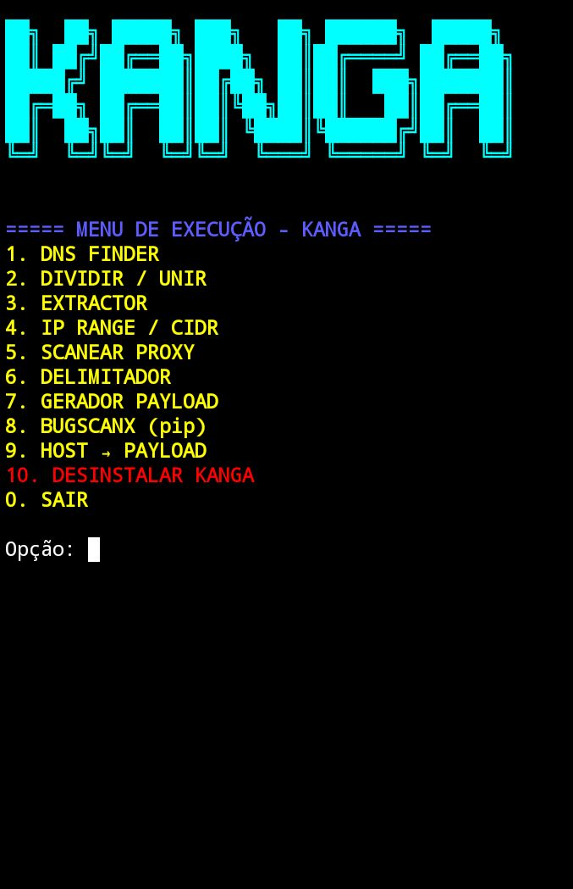

🐍 KANGA HACK
Ferramenta multifuncional para Termux / Linux, focada em networking, DNS, IPs, proxies e geração de payloads, tudo reunido em um único menu interativo no terminal.
Interface simples, rápida e direta, ideal para estudos, testes e automação de tarefas relacionadas a redes.
⚡ Funcionalidades
O KANGA HACK oferece as seguintes opções:

1. DNS Finder
→ Localiza e resolve domínios e DNS.

2. Dividir / Unir
→ Divide ou une listas e arquivos de texto.

3. Extractor
→ Extrai dados específicos de arquivos ou listas.

4. IP Range / CIDR
→ Gera intervalos de IPs a partir de CIDR ou ranges.

5. Scanear Proxy
→ Testa proxies e verifica disponibilidade.

6. Delimitador
→ Manipula textos usando delimitadores personalizados.

7. Gerador Payload
→ Criação de payloads para testes de conexão.





📦 Instalação
🔽 Clone e instale com um único comando

```bash
git clone https://github.com/Adaokanga/KANGA-HACK.git && cd KANGA-HACK/ && bash denny.sh && cd && rm -rf KANGA-HACK/
```


▶️ Como Executar
Após a instalação, basta digitar no terminal:

```bash
KANGA
```

Isso abrirá o menu interativo da ferramenta.


📱 Compatibilidade
✅ Termux (Android)
✅ Linux
⚠️ Não recomendado para ambientes Windows sem WSL
🛠️ Requisitos
git
bash
python (caso solicitado pelo script)
Conexão com a internet


⚠️ Aviso Legal
Esta ferramenta foi criada apenas para fins educacionais e de estudo.
O autor não se responsabiliza pelo uso indevido.
Use com responsabilidade.
👤 Autor
Denny-a Gvo 👻
GitHub: https://github.com/Adaokanga
